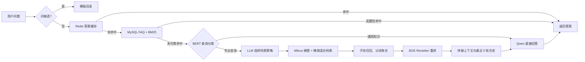

# 从 FAQ 到混合检索：我如何搭建一个教育场景的分层 RAG 问答系统

> 本文基于 EduRag 项目的当前代码整理。它更适合作为项目复盘和技术方案说明，而不是一份可以直接复制运行的部署教程。文末列出了当前仓库仍需补齐的工程化内容。

建议标签：`RAG`、`Milvus`、`BGE-M3`、`BM25`、`FastAPI`、`教育大模型`

## 一、为什么要做这个项目

教育咨询中的问题大致可以分成两类：

- “Python 学科包含哪些课程？”这类高频、答案稳定的问题，适合直接从标准 FAQ 中匹配答案；
- “人工智能课程和 Java 课程有什么区别？”这类开放问题，需要从课程大纲、PDF 等非结构化材料中检索并组织答案。

如果所有问题都交给大模型，不仅成本和延迟更高，还容易产生幻觉；如果只做关键词匹配，又无法回答复杂、长尾的问题。因此 EduRag 采用分层处理思路：先用低成本的 FAQ 检索解决确定性问题，未可靠命中时再进入 RAG 流程。

项目当前包含 467 条 Python、Java 学科 FAQ，以及 Markdown、PDF 等课程知识文档。

## 二、系统架构

主要技术栈如下：

| 层次 | 技术 |
| --- | --- |
| Web 服务 | FastAPI、WebSocket、静态 HTML |
| FAQ 检索 | MySQL、Redis、jieba、BM25 |
| 文档处理 | LangChain Document、中文递归切分、OCR Loader |
| 向量检索 | Milvus 2.4.4、BGE-M3 |
| 重排序 | BGE-Reranker-Large |
| 查询分类 | bert-base-chinese 二分类模型 |
| 生成模型 | DashScope OpenAI 兼容接口、Qwen |
| 观测与评估 | LangSmith、RAGAS |

## 三、第一层：用 FAQ 承接高频确定性问题

FAQ 数据保存在 MySQL 的 `jpkb` 表中，字段包括学科、问题和答案。系统启动时读取全部标准问题，对问题分词后构建 `BM25Okapi` 索引。

一次 FAQ 查询的顺序是：

1. 先以原始问题作为键查询 Redis；
2. 缓存未命中时，对问题分词并计算所有 FAQ 的 BM25 分数；
3. 对分数做 Softmax 归一化，最高分达到阈值时，从 Redis 或 MySQL 读取答案；
4. 将“用户问法”和“标准问法”对应的答案都写入 Redis；
5. 未达到阈值时，返回 RAG 兜底标记。

这一层的意义不是替代 RAG，而是把高频、固定答案的问题挡在成本更低的路径上。对于招生政策、课程版本、上课时间等标准咨询，这种设计通常比每次调用大模型更快、更可控。

需要注意的是，Softmax 后的最高分会受到 FAQ 总量和其他候选分数分布影响，因此代码中的 `0.85` 不是天然可靠的“相似度”。更稳妥的做法是在真实问法数据上调参，并同时观察 Top-1 原始分数和 Top-1/Top-2 间隔。

## 四、第二层：先判断问题是否真的需要检索

进入 RAG 子系统后，系统首先使用本地微调的中文 BERT，将问题分成：

- 通用知识：不查询课程知识库，直接调用大模型；
- 专业咨询：进入文档检索流程。

这一步本质上是一个路由器。它可以减少无意义的向量检索，也能防止课程知识库中的局部材料干扰通用问题。

分类器采用懒加载方式：第一次预测时才加载 tokenizer 和模型，并按 CUDA、MPS、CPU 的顺序自动选择设备。训练代码使用 90%/10% 的训练验证划分，默认训练 3 个 epoch。

## 五、动态选择四种检索策略

专业咨询并不都适合直接搜索。项目使用一次 LLM 调用，从四种策略中选择一种：

1. 直接检索：问题目标明确，例如询问某门课的学费或大纲；
2. HyDE：先生成一段假设答案，再用假设答案检索，适合表达抽象的问题；
3. 子查询检索：把比较型、多实体问题拆成多个子问题，分别检索后合并去重；
4. 回溯问题检索：把复杂问题改写成更基础、更容易命中知识库的问题。

例如“人工智能课程和 Java 课程有什么区别”涉及两个实体，适合拆成“人工智能课程的内容是什么”和“Java 课程的内容是什么”，分别召回材料后再综合回答。

动态路由提高了复杂问题的召回机会，但也增加了一次模型调用和策略不稳定性。后续可以先用规则处理明显问题，仅把边界样本交给 LLM 选择，以平衡效果、成本和延迟。

## 六、BGE-M3 + Milvus 的混合检索

EduRag 使用 BGE-M3 同时生成两种表示：

- dense vector：捕获语义相似性，维度为 1024；
- sparse vector：保留关键词和词项层面的匹配能力。

Milvus 中分别建立 `IVF_FLAT` 稠密索引和 `SPARSE_INVERTED_INDEX` 稀疏索引。查询时并行搜索两路向量，再通过 `WeightedRanker(0.7, 1.0)` 融合稀疏、稠密结果。

混合检索适合课程咨询场景：课程名、技术名、版本号需要精确匹配，而用户对课程内容的自然描述又依赖语义召回。单独使用关键词或稠密向量都可能顾此失彼。

## 七、父子分块：小块负责命中，大块负责回答

文档入库前会进行两级切分：

1. 先把原始文档切成较大的父块；
2. 再把每个父块切成较小的子块；
3. 子块写入 Milvus，同时保存 `parent_id` 和 `parent_content`；
4. 检索时用子块提高命中精度，再按父块内容聚合；
5. 对去重后的父块使用 BGE-Reranker 重排，最终取少量父块交给大模型。

这种方式解决了传统固定分块中的矛盾：块太大时检索信号被稀释，块太小时又缺少回答所需的上下文。
 
文档处理目前支持 `.txt`、`.md`、`.pdf`、`.docx`、`.ppt/.pptx`、`.jpg/.png`。普通中文文本使用自定义递归切分器，  down 使用专用切分器，扫描件和图片通过 OCR Loader 处理。文档所在的一级目录还会转成 `source` 元数据，用于按学科过滤。

## 八、重排、生成与多轮对话

混合检索拿到候选父块后，系统用 CrossEncoder 对“问题—父块”逐对打分。相比只看向量相似度，交叉编码器可以更细致地判断候选内容是否真正回答了问题。

最终 Prompt 包含三部分：检索上下文、最近 5 轮对话历史和当前问题。模型被要求优先基于材料作答，在信息不足时返回统一的人工客服提示。

Web 层提供会话创建、历史查询、历史清除、会话列表、学科列表和健康检查接口，并通过 WebSocket 向页面发送 `start`、`token`、`end` 三类消息。

不过从当前代码看，核心 `RAGSystem.generate_answer` 返回的是完整字符串，并不直接产生 token 流；真正的增量生成需要在模型调用层使用流式 API，而不只是由 WebSocket 分段转发结果。

## 九、如何评估系统

仓库包含 30 条离线问答样本，并使用 RAGAS 计算四个指标。当前保存结果的均值为：

| 指标 | 均值 |
| --- | ---: |
| Faithfulness | 0.7833 |
| Answer Relevancy | 0.9471 |
| Context Precision | 1.0000 |
| Context Recall | 1.0000 |

这些数字只能作为已有样本上的离线参考，不能直接当作线上系统准确率。当前评估文件已经给定了 `context`、`answer` 和 `ground_truth`，并未从运行中的完整检索链路实时生成结果；上下文精确率和召回率达到 1.0，也很可能与人工整理的上下文高度相关。

更完整的评估应至少分成三层：

- 路由评估：FAQ/RAG 路由、通用/专业分类是否正确；
- 检索评估：Recall@K、MRR、NDCG，以及不同检索策略的命中率；
- 生成评估：忠实度、答案相关性、拒答正确率，并结合人工抽检。

## 十、我在这个项目中的几个设计取舍

第一，能确定回答的内容尽量不经过大模型。FAQ 层除了降低成本，也提供了更强的答案一致性。

第二，检索和生成解耦。BGE-M3 负责召回，BGE-Reranker 负责精排，Qwen 只负责理解上下文并组织答案，各模块职责相对清晰。

第三，用父子分块平衡命中精度和上下文完整度。检索单元与生成单元不必是同一种粒度。

第四，对复杂查询做检索前改写。HyDE、子查询和回溯问题不是为了让流程显得复杂，而是解决用户问题与文档表达不一致的问题。

## 十一、当前版本的不足与下一步计划

当前仓库更像一个完成了核心算法验证、但尚未收口的工程版本。发布或演示前，我会优先处理以下事项：

1. 补齐 `new_main.py` 中的 `IntegratedQASystem`。目前 Web 入口依赖它，但该文件为空，FAQ、RAG、会话持久化和流式输出尚未在这一层形成可运行闭环；
2. 增加 `requirements.txt` 或 `pyproject.toml`，固定 Python 与第三方依赖版本；
3. 增加 `.env.example` 和安全的配置说明，避免在文章或仓库中公开数据库密码、API Key 和客服电话；
4. 为 Docker Compose 补充 MySQL，或明确 MySQL 使用外部实例；
5. 增加独立的知识库初始化命令，移除 `vector_store.py`、`ragas_evaluate.py` 中的本机绝对路径；
6. 让 `source_filter` 在 HyDE、子查询和回溯检索中同样生效；
7. 改为真正的 LLM 流式生成，并将同步模型推理移出 FastAPI 事件循环；
8. 增加单元测试和端到端测试，重点覆盖缓存命中、低置信回退、分类路由、检索过滤和断线重连；
9. 使用端到端生成的数据重新跑 RAGAS，并增加真实用户问题与失败案例；
10. 记录各路径的延迟、Token 消耗和命中率，才能量化分层架构带来的收益。

## 十二、总结

EduRag 的核心并不是简单地“把文档放进向量数据库”，而是针对不同问题选择不同成本和不同可靠性的路径：标准问题走 FAQ，通用问题直接生成，专业问题再通过动态策略、混合检索、父子块聚合和重排获取上下文。

这套方案已经覆盖了一个教育问答系统最值得讨论的 RAG 设计点：分层路由、混合检索、查询改写、父子分块、重排、多轮历史和离线评估。下一阶段的重点不再是继续堆叠检索技巧，而是补齐集成层、依赖管理、自动化测试和端到端评估，让算法原型真正变成稳定可运行的应用。

---

## 发布时可选标题

- 《从 FAQ 到 RAG：教育问答系统的分层检索实践》
- 《BGE-M3 + Milvus：一个教育场景混合检索系统的设计与复盘》
- 《小块召回、大块生成：EduRag 的父子分块与重排实践》
- 《不是什么问题都要交给大模型：我的分层 RAG 架构》

## 建议配图

1. 将“系统架构”中的 Mermaid 流程图导出为首张架构图；
2. 绘制“原始文档 → 父块 → 子块 → 子块召回 → 父块返回”的父子分块示意图；
3. 使用同一问题对比关键词检索、稠密检索、混合检索的 Top-K 结果；
4. 放一张真实问答页面截图，但先隐藏主机地址、会话 ID、API Key、客服电话等信息。

## 源码导读

| 文件 | 作用 |
| --- | --- |
| `main.py` | 命令行入口，负责 FAQ 查询并在低置信时尝试进入 RAG |
| `app.py` | FastAPI、WebSocket、会话与静态页面接口 |
| `mysql_qa/retrieval/bm25_search.py` | FAQ 的 BM25 匹配、阈值判断和缓存逻辑 |
| `rag_qa/core/document_processor.py` | 多格式文档加载、来源标记与父子分块 |
| `rag_qa/core/vector_store.py` | BGE-M3 向量化、Milvus 混合检索和重排 |
| `rag_qa/core/query_classifier.py` | 通用知识/专业咨询二分类及训练逻辑 |
| `rag_qa/core/strategy_selector.py` | 使用 LLM 选择四种检索策略 |
| `rag_qa/core/rag_system.py` | RAG 查询编排、上下文构建与答案生成 |
| `rag_qa/core/prompts.py` | RAG、HyDE、子查询和回溯 Prompt |
| `rag_qa/core/ragas_evaluate.py` | RAGAS 离线评估脚本 |
