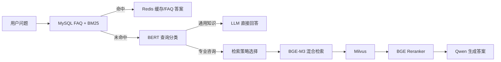

# EduRAG

面向 IT 教育与培训场景的智能问答系统。项目将结构化 FAQ 检索与非结构化文档 RAG 结合，用低成本的数据库检索优先回答常见问题，并在未命中时通过混合向量检索、重排序和大语言模型生成答案。

## 核心能力

- **FAQ 快速问答**：MySQL 保存问答对，BM25 负责文本召回，Redis 缓存热点答案。
- **智能 RAG 路由**：BERT 查询分类器区分通用知识与专业咨询。
- **多策略检索**：支持直接检索、HyDE、子查询和回溯问题四种策略。
- **混合向量搜索**：BGE-M3 同时生成稠密与稀疏向量，在 Milvus 中完成混合检索。
- **结果重排序**：使用 BGE Reranker 对候选文档重新排序。
- **多格式文档处理**：支持 Markdown、PDF、Word、PowerPoint 和图片，并提供 OCR 加载能力。
- **国产模型接口**：通过 OpenAI 兼容协议调用 DashScope（Qwen）。

## 工作流程



## 项目结构

```text
EduRag/
├── base/                       # 配置与日志
├── mysql_qa/                   # MySQL + Redis + BM25 FAQ 系统
├── rag_qa/
│   ├── core/                   # 分类、策略、检索、生成与评估
│   ├── edu_document_loaders/   # PDF、DOCX、PPTX、图片及 OCR 加载器
│   ├── edu_text_spliter/       # 中文文本切分器
│   ├── classify_data/          # 查询分类数据
│   ├── data/                   # 示例知识文档与评估数据
│   └── models/                 # 本地模型目录（不纳入 Git）
├── static/                     # 前端页面
├── app.py                      # FastAPI/WebSocket 入口（开发中）
├── main.py                     # FAQ 优先、RAG 回退的 CLI 入口
└── docker-compose.yml          # Milvus、etcd、MinIO、Redis
```

## 环境要求

- Python 3.10
- Docker 与 Docker Compose
- MySQL 5.7+ 或 8.x
- 可选：支持 CUDA 的 NVIDIA GPU（无 GPU 时会回退到 CPU）

使用项目依赖清单安装 Python 包：

```bash
python -m pip install -r requirements.txt
```

## 快速开始

### 1. 克隆项目

```bash
git clone https://github.com/qiuxuezhe345/Edu-RAG.git
cd Edu-RAG
```

### 2. 准备本地模型

模型权重体积较大，未提交到 GitHub。请将兼容的模型放入以下目录：

```text
rag_qa/models/
├── bert-base-chinese/
├── bert_query_classifier/
├── bge-m3/
└── bge-reranker-large/
```

分类器模型不存在时，代码会尝试基于 `bert-base-chinese` 初始化；向量模型和重排序模型必须提前准备。

### 3. 创建配置文件

复制配置模板并填写本机数据库密码和 DashScope API Key。`config.ini` 已被 `.gitignore` 排除，请勿提交真实密码或 API Key。

```powershell
Copy-Item config.ini.example config.ini
```

```ini
[mysql]
host = localhost
user = root
password = your_mysql_password
database = subjects_kg

[redis]
host = localhost
port = 6379
password = 1234
db = 0

[milvus]
host = localhost
port = 19530
database_name = itcast
collection_name = edurag_xian_1

[llm]
model = qwen-plus
dashscope_api_key = your_dashscope_api_key
dashscope_base_url = https://dashscope.aliyuncs.com/compatible-mode/v1

[retrieval]
parent_chunk_size = 1200
child_chunk_size = 300
chunk_overlap = 50
retrieval_k = 5
candidate_m = 2

[logger]
log_file = logs/app.log

[app]
valid_sources = ["ai", "java", "test", "ops", "bigdata"]
customer_service_phone = 12345678

[classifier]
bert_model_path = rag_qa/models/bert-base-chinese
classifier_data_path = rag_qa/classify_data/model_generic_5000.json
classifier_model_path = rag_qa/models/bert_query_classifier

[demo]
test = false
```

也可以使用环境变量覆盖部分敏感或机器相关配置：

```bash
export DASHSCOPE_API_KEY="your_dashscope_api_key"
export MILVUS_HOST="localhost"
export MILVUS_PORT="19530"
```

PowerShell 示例：

```powershell
$env:DASHSCOPE_API_KEY = "your_dashscope_api_key"
```

如不使用 LangSmith 链路追踪，可设置 `LANGSMITH_TRACING=false`。

### 4. 启动基础服务

```bash
docker compose up -d
```

该命令会启动 Milvus、etcd、MinIO 和 Redis。MySQL 需要单独安装和启动。

### 5. 初始化 FAQ 数据

先在 MySQL 中创建 `config.ini` 指定的数据库，然后执行：

```bash
python -c "from mysql_qa.db.mysql_client import MySQLClient; c=MySQLClient(); c.create_table(); c.insert_data('mysql_qa/data/JP学科知识问答.csv'); c.close()"
```

### 6. 运行问答系统

仅运行 RAG 命令行：

```bash
python rag_qa/main.py
```

运行 FAQ 优先、RAG 回退的命令行入口：

```bash
python main.py
```

## 文档入库

文档处理主流程位于 `rag_qa/core/document_processor.py`，向量写入逻辑位于 `rag_qa/core/vector_store.py`。入库前请确保 Milvus 已启动、本地嵌入模型已准备，并根据实际资料设置文档来源字段。

## 当前状态

- CLI 问答流程是当前主要运行方式。
- `app.py` 已包含 FastAPI、REST 与 WebSocket 路由，但它依赖的 `new_main.IntegratedQASystem` 尚未实现，因此 Web 服务暂不能直接启动。
- 项目尚未提供完整自动化测试和固定依赖版本。
- `rag_qa/edu_text_spliter/edu_model_text_spliter.py` 中仍有机器相关的本地模型路径，不属于默认切分流程。

## 安全说明

- 不要提交 `config.ini`、`.env`、模型权重、数据库文件或运行日志。
- 推荐通过环境变量注入 API Key，并定期轮换凭据。
- `docker-compose.yml` 中的 Redis 与 MinIO 凭据仅适合本地开发，部署前必须更换并限制端口暴露。

## 后续计划

- [ ] 补充并锁定 `requirements.txt`
- [ ] 实现 `IntegratedQASystem`，打通 FastAPI Web 服务
- [ ] 增加模型下载与文档入库脚本
- [ ] 增加单元测试和端到端测试
- [ ] 将本地开发凭据迁移为环境变量

## License

本项目暂未声明开源许可证。如需复用或分发，请先联系仓库所有者。
